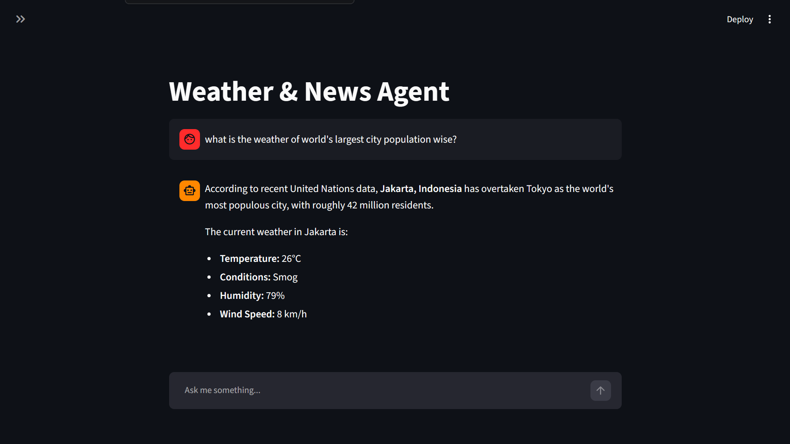

# 🌍 Weather & News Agent 🤖

**🌐 Live Demo:** [https://weather-news-agent.onrender.com](https://weather-news-agent.onrender.com)

Welcome to the **Weather & News Agent**, an intelligent, tool-using AI chatbot powered by **LangGraph**, **Google Gemini**, and **Streamlit**. It doesn't just chat—it *acts*. Need the latest global news? It searches the web. Want the weather in Tokyo (or Jakarta!)? It fetches real-time data.



## ✨ Features
- **🧠 Agentic Reasoning**: Uses LangGraph's ReAct architecture to break down complex queries, decide which tools to use, and formulate precise answers.
- **🛠️ Custom Tools**: Equipped with Tavily for deep web searches and WeatherStack API for real-time climate data.
- **💬 Interactive UI**: A sleek Streamlit interface complete with an expandable sidebar.
- **⚙️ Advanced Controls**: Edit the AI's core instructions on the fly, toggle multi-line inputs, and manually correct chat history in real-time!

## 🚀 Quickstart (Local)
1. **Clone & Setup**: Create a virtual environment and install dependencies.
   ```bash
   pip install -r requirements.txt
   ```
2. **Environment Variables**: Create a `.env` file in the root directory with your API keys:
   ```env
   GEMINI_API_KEY=your_key
   TAVILY_API_KEY=your_key
   WEATHERSTACK_API_KEY=your_key
   ```
3. **Run the App**:
   ```bash
   streamlit run app.py
   ```

## ☁️ Deploying to Render
This project is **100% Render-ready**! We've included a `main.py` entrypoint specifically to handle Render's dynamic port bindings for Streamlit.
1. Create a new **Web Service** on Render connected to your repository.
2. Set the **Build Command** to: `pip install -r requirements.txt`
3. Set the **Start Command** to: `python main.py`
4. Add your API keys to the **Environment** tab on Render.
5. Deploy and enjoy your live AI agent!
